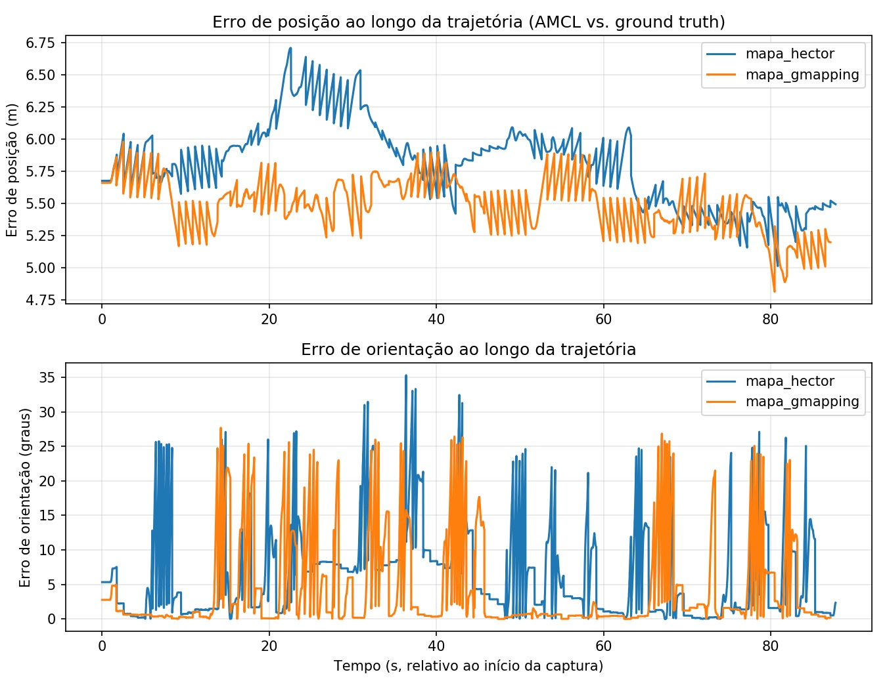
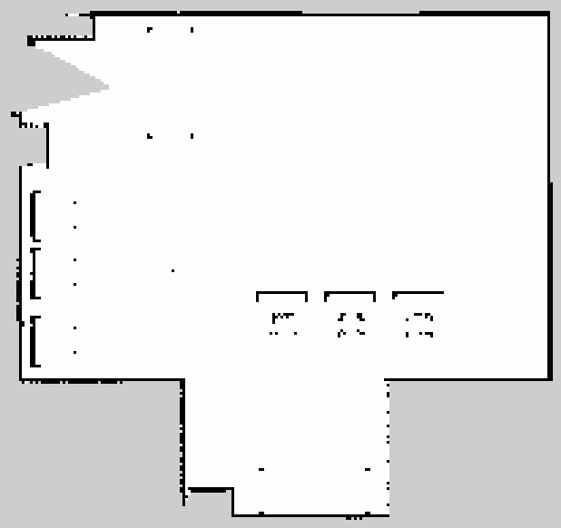
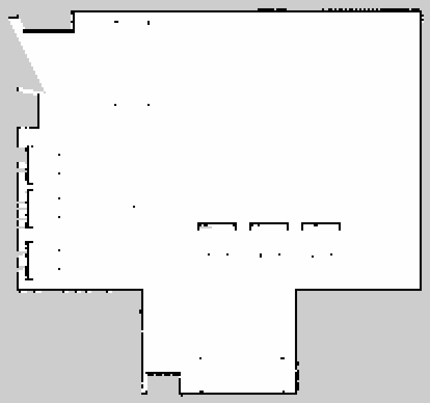
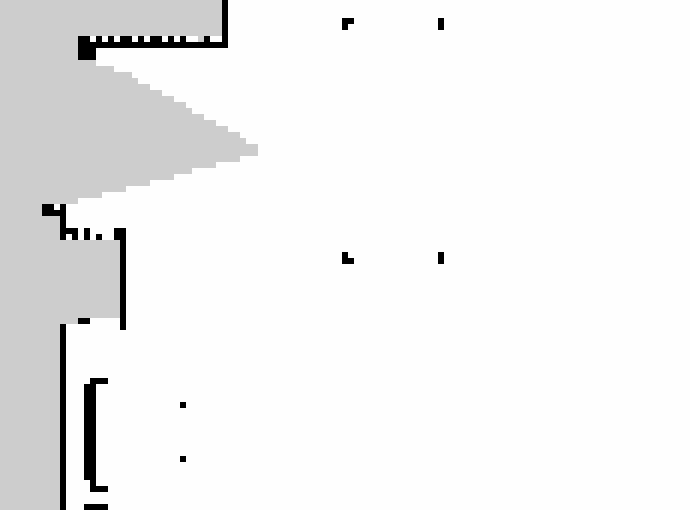
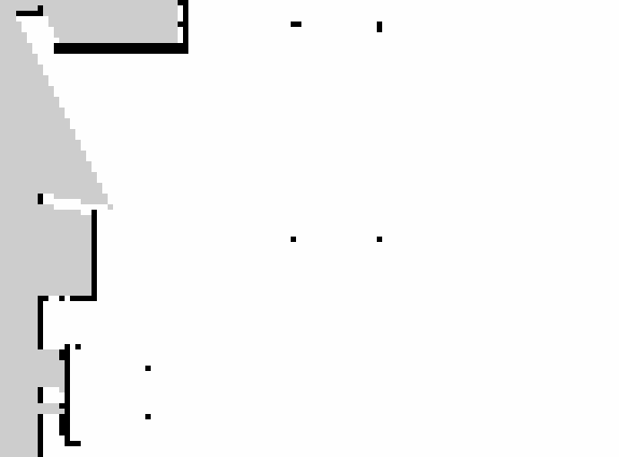
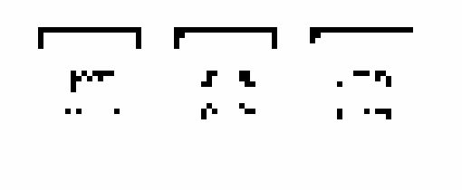
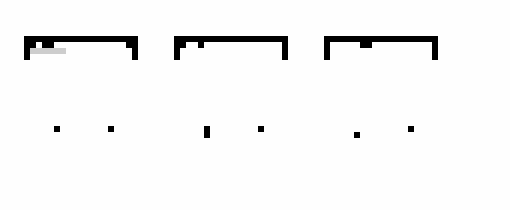
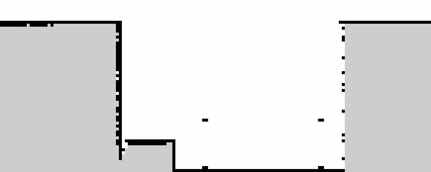
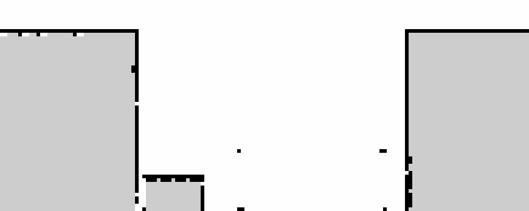

# Comparação SLAM (Gmapping vs. Hector) e Localização com AMCL — Simulação LaR/UFBA

O projeto compara dois métodos de SLAM (**Gmapping** e **Hector SLAM**) na geração de mapas do ambiente simulado do LaR, seguido de localização com **AMCL** sobre cada mapa, comparando a pose estimada com o *ground truth* fornecido pelo Gazebo (`/gazebo/model_states`).

Este repositório usa como base o pacote ROS [`lar_gazebo`](https://github.com/lar-deeufba/lar_gazebo) do laboratório LaR/UFBA (ambiente simulado, modelos, mundo, integração com Husky). Sobre essa base foram adicionados os arquivos desta atividade: `launch/amcl.launch`, `scripts/captura_poses.py`, `scripts/calcular_metricas.py`, os mapas gerados e os resultados.

Para o passo a passo de execução (Docker, geração dos mapas, AMCL, cálculo de métricas), veja o [`COMORODAR.md`](COMORODAR.md).

## Resultados

### Métricas quantitativas

| Métrica | Hector SLAM | Gmapping |
|---|---|---|
| Amostras consideradas | 8.778 | 8.718 |
| RMSE de posição (m) | 5,8215 | 5,4958 |
| Erro de posição final (m) | 5,4953 | 5,2002 |
| Erro de orientação final (graus) | 2,34 | 0,22 |
| Erro de orientação médio (graus) | 6,65 | 4,42 |
| Desvio padrão do erro de posição (m) | 0,3151 | 0,1991 |
| Erro de posição (min / max) (m) | 5,0145 / 6,7098 | 4,8152 / 5,9816 |

*O gráfico acima mostra o erro instantâneo (AMCL vs. ground truth) amostra a amostra. Note que o erro de posição (gráfico superior) oscila dentro de uma faixa estreita (~5 a ~6,7 m) sem tendência de crescimento ao longo do tempo — é justamente esse comportamento "deslocado, mas estável" que indica um offset de calibração, e não divergência do filtro de partículas (detalhes na seção Limitações). O erro de orientação (gráfico inferior) tem picos pontuais durante as curvas do robô, mas retorna a valores baixos nos trechos de movimento reto, o que é esperado e normal.*

O RMSE e o erro de posição final acima **não representam a precisão real da localização** pelo motivo explicado abaixo. Por isso, a comparação principal usa o desvio padrão do erro de posição e o erro de orientação, que não são afetados por um deslocamento constante somado a todas as amostras.

### Análise qualitativa dos mapas

#### Visão geral

| Hector SLAM | Gmapping |
|---|---|
|  |  |

Os dois métodos reconstruíram o mesmo ambiente: contorno externo em "L", uma sala principal com três objetos centrais (mesas), uma reentrância lateral com pequenos nichos (provavelmente armários/prateleiras) e uma abertura na parede superior esquerda (porta/corredor). A planta geral é equivalente nos dois mapas, o que já indica que ambos os algoritmos fizeram um scan matching consistente durante a exploração.

A diferença visível de tamanho de arquivo é só de configuração: o `mapa_hector.pgm` foi salvo num grid de 256×256 px (~13×13 m, resolução 0,05 m/px), enquanto o `mapa_gmapping.pgm` usa o grid padrão de 1984×1984 px (~99×99 m) — a imagem acima já está recortada na região efetivamente mapeada para facilitar a comparação visual.

#### Região desconhecida (entrada/corredor)

| Hector SLAM | Gmapping |
|---|---|
|  |  |

A área cinza em forma de cunha no canto superior esquerdo é a mesma nos dois mapas: uma região que o laser nunca varreu por completo (provavelmente uma porta ou passagem pouco explorada durante a teleoperação). O tamanho e a posição da cunha são muito parecidos entre os dois métodos, o que sugere que essa área desconhecida é fruto da trajetória percorrida (cobertura de exploração), não de uma limitação do algoritmo de SLAM em si.

#### Obstáculos centrais (mesas)

| Hector SLAM | Gmapping |
|---|---|
|  |  |

Aqui aparece a diferença mais clara entre os dois mapas. No Hector, o contorno inferior dos três objetos centrais aparece fragmentado, com pontos de ruído espalhados ao redor das bordas (obstáculos "borrados"). No Gmapping, a borda superior dos mesmos três objetos é bem mais sólida e reta — um deles tem uma leve mancha cinza, mas sem fragmentação. Isso é coerente com a forma como cada algoritmo constrói o mapa: o Gmapping integra várias passagens do filtro de partículas sobre a mesma região ao longo da exploração, enquanto o Hector depende do casamento instantâneo do laser contra o mapa em construção, ponto a ponto.

#### Paredes do corredor inferior

| Hector SLAM | Gmapping |
|---|---|
|  |  |

As duas paredes verticais que formam o corredor inferior aparecem como uma linha tremida/pontilhada no Hector (uma espécie de "serrilhado"), enquanto no Gmapping a mesma parede é mais sólida e contínua. O pequeno degrau na parede (visível nos dois mapas, no canto inferior esquerdo) é uma feição real do ambiente — está presente e alinhado nos dois métodos, então não é um erro de SLAM.

#### Resumo da análise qualitativa

| Critério | Hector SLAM | Gmapping |
|---|---|---|
| Completude | Contorno completo, mapa compacto | Contorno completo, grid maior que o necessário (sem ganho de informação) |
| Distorções | Paredes do corredor com serrilhado visível | Paredes mais sólidas; pequena saliência cinza em um canto |
| Paredes desalinhadas | Não há desalinhamento estrutural; degrau de parede é consistente com o gmapping | Idêntico ao Hector nesse ponto |
| Obstáculos falsos | Mesas com contorno fragmentado e ruído ao redor | Mesas com borda mais sólida; leve mancha em um objeto |
| Regiões desconhecidas | Cunha de área desconhecida na entrada | Mesma cunha, tamanho e posição comparáveis |
| Qualidade da localização (AMCL) | Desvio padrão do erro ~58% maior; orientação média 6,65° | Maior estabilidade; orientação média 4,42° |

## Discussão

### Qual método produziu o melhor mapa

Os dois métodos reconstruíram corretamente a mesma planta, o que já indica boa qualidade de scan matching em ambos. A diferença fica nos detalhes finos: o Hector deixou os contornos da parede do corredor inferior e dos objetos centrais visivelmente mais ruidosos/fragmentados, enquanto o Gmapping produziu bordas mais sólidas e contínuas nesses mesmos pontos — provavelmente por integrar várias passagens do filtro de partículas sobre a mesma região ao longo da exploração, em vez de depender só do casamento instantâneo do laser feito pelo Hector. Em compensação, o arquivo do Gmapping foi salvo com a grade padrão de 1984×1984 px, praticamente toda desconhecida fora da área realmente percorrida — um detalhe de configuração do `gmapping.launch`, não de qualidade de mapeamento, mas que deixa o arquivo bem mais pesado sem ganho de informação.

Considerando completude e fidelidade dos detalhes (objetos e paredes), o **Gmapping produziu o mapa qualitativamente melhor** nesta execução.

### Qual mapa permitiu melhor localização com AMCL

O Gmapping também levou vantagem em todas as métricas não distorcidas pelo offset de calibração: desvio padrão do erro de posição de 0,1991 m contra 0,3151 m do Hector (~37% menor), erro de orientação final de 0,22° contra 2,34°, e erro de orientação médio de 4,42° contra 6,65°. Isso é coerente com a análise qualitativa — um mapa com bordas mais sólidas e menos ruído nos objetos centrais tende a oferecer ao *likelihood field* do AMCL referências mais consistentes a cada atualização do scan, reduzindo a variância da pose estimada.

Ou seja, nesta execução o **mapa gerado pelo Gmapping permitiu tanto o mapa de melhor qualidade quanto a localização mais estável com AMCL**.

## Limitações conhecidas

Conferindo diretamente os CSVs de captura, a diferença entre `gt_x,gt_y` e `amcl_x,amcl_y` é praticamente constante do início ao fim da trajetória em ambos os mapas (~5,5 m no Hector, ~5,2 m no Gmapping), enquanto o erro de orientação converge para valores pequenos (2,34° e 0,22°). Essa é a assinatura de um **offset de calibração no `2D Pose Estimate` inicial** — muito provavelmente posicionado próximo à origem do frame do mapa em vez da pose real do Husky no Gazebo (`/gazebo/model_states` indicava o robô em torno de `x≈4,65 m, y≈3,0 m`, bem distante da estimativa inicial do AMCL) — e não de divergência/drift do filtro de partículas, que se manteve estável (baixo desvio padrão) em torno dessa referência deslocada.

Esse tipo de erro não gera nenhum aviso nos logs do ROS — o AMCL converge normalmente e parece saudável, só que com a referência inteira deslocada. Por isso, o RMSE e o erro de posição final na ordem de 5 m não devem ser lidos como precisão real de localização; o desvio padrão e o erro de orientação são as métricas confiáveis nesta execução. Em uma próxima rodada, vale confirmar com `rostopic echo /gazebo/model_states -n 1` e `/amcl_pose -n 1` antes de iniciar a captura, exatamente como recomendado no [`COMORODAR.md`](COMORODAR.md).

## Autor

*DANIEL SILVA DE SOUZA* — UFBA, Tópicos Especiais em Engenharia Elétrica IV